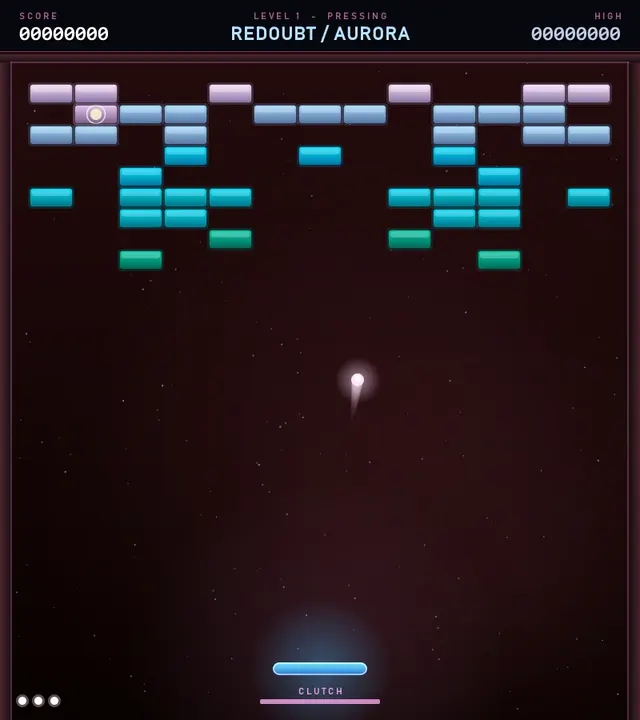
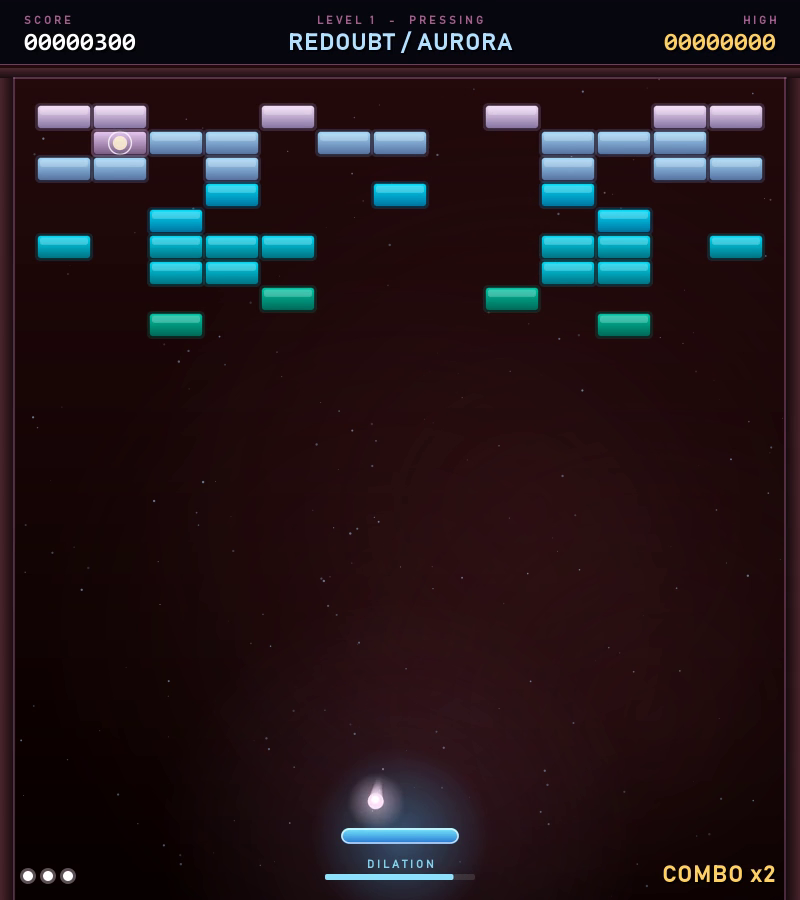
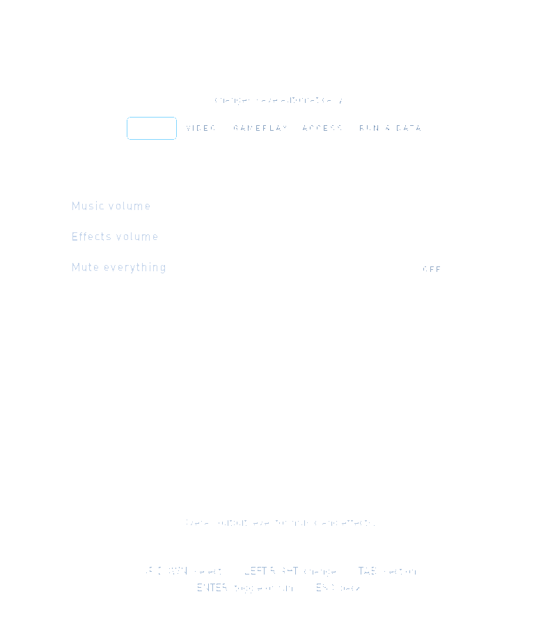
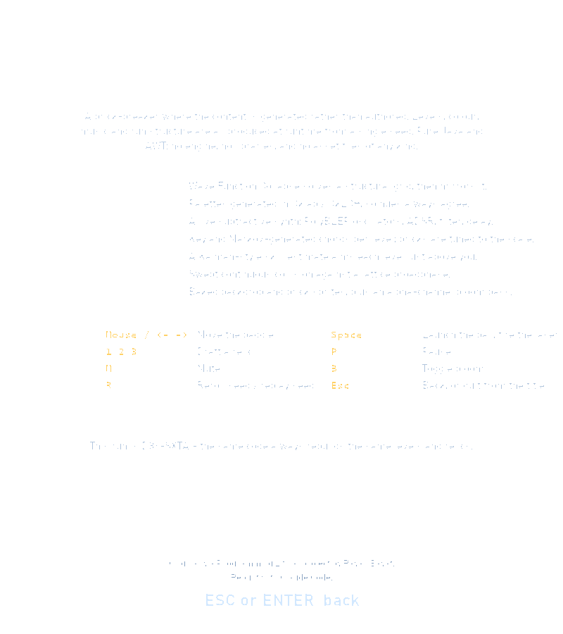

<div align="center">

# ARKANOID // RESONANCE

**A generative, musical brick-breaker built with pure Java.**




[Download the gameplay clip (MP4)](docs/media/gameplay.mp4)

</div>

A brick-breaker where the content is generated rather than authored: levels,
colour, music and run structure are all produced at runtime from a single seed.
Pure Java + AWT/Swing — no engine, no libraries, no asset files of any kind.

## Gallery

<table>
  <tr>
    <td width="33%"></td>
    <td width="33%"></td>
    <td width="33%"></td>
  </tr>
  <tr>
    <td align="center"><sub>Generative levels and reactive effects.</sub></td>
    <td align="center"><sub>Player controls that save automatically.</sub></td>
    <td align="center"><sub>Controls and technology at a glance.</sub></td>
  </tr>
</table>

## Running

There is no JDK on this machine's `PATH`; IntelliJ's bundled JetBrains Runtime
(a full JDK 21) works. Run from the project root — the `Lastscore` high-score
file is resolved against the working directory.

```sh
JDK="/c/Program Files/JetBrains/IntelliJ IDEA Community Edition 2025.2.6.2/jbr/bin"

"$JDK/javac" -d out src/Arkanoid/*.java
"$JDK/java"  -cp out Arkanoid.Arkanoid
```

Add `-Darkanoid.debug=true` for a frame-timing overlay, a periodic timing log,
and `K` to force-clear a level (useful for exercising level transitions).

## What makes it different

**Levels are solved, not drawn.** `Wfc.java` is a Wave Function Collapse
constraint solver. The tile alphabet is structural — `VOID`, `EDGE`, `FILL`,
`CORE`, `SPUR` — and the adjacency rules are where the design lives: `VOID` may
never touch `FILL`, so every solid mass ends up wrapped in an edge; `CORE` may
only touch `FILL` or `CORE`, so armoured bricks are always buried inside a shape
rather than stranded in open space. Boards are solved at half width and
mirrored, which costs nothing (every tile is self-compatible, so the seam is
always legal) and is most of what makes a generated layout read as composed.

A flood fill then proves every breakable brick is reachable; if a ring of
indestructible blocks has sealed something in, the solids are demoted rather
than shipping an unwinnable board. A feedback loop on the tile weights keeps
brick counts inside a playable window — verified across 400 generated boards.

**Colour is perceptual.** `Palette.java` works in Oklab/OkLCH, not RGB. Rotating
hue at fixed lightness and chroma gives a set of colours that belong to each
other; the original's `new Color(random * 0x1000000)` gave neon yellow next to
near-black brown, because sRGB is not perceptually uniform.

**The soundtrack is synthesised live, and the board is an instrument.**
`Audio.java` is a real-time subtractive synth: PolyBLEP-antialiased oscillators,
per-voice ADSR, a resonant state-variable filter and a stereo delay, rendered on
its own thread. `Music.java` picks a key and mode per level and generates a
chord progression with a weighted Markov chain over diatonic degrees, with
layers gated by an intensity value the game feeds in.

The part that matters is the other direction: every brick carries a **scale
degree** derived from its position. Breaking one plays a note in the current key,
columns walk the scale and rows step by octave, and a long combo lifts the whole
run an octave. Playing well composes a melody.

**Runs, not levels.** After each level you draft one of three relics from
`Relic.java`, and they stack for the rest of the run and interact — `HEAVY` plus
`CHAIN_REACTION` is a demolition build, `METRONOME` plus `KEEN_EDGE` turns the
board into one enormous combo, `PRISM` plus `SPLIT_SHOT` floods the screen.

**Difficulty aims itself.** `SkillModel.java` keeps a running estimate of player
skill with an explicit uncertainty, updated after each level with a Kalman-style
correction, and targets a difficulty slightly above it. Early levels move the
estimate a lot; it settles as evidence accumulates, and re-inflates slightly each
level so it can still follow a player who is warming up or tiring.

**Collision is continuous.** `Physics.java` sweeps the ball's path and takes the
first surface it crosses. A discrete overlap test mis-picks the *side* face of a
neighbouring brick when the ball skims a flat row, kicking it sideways off what
is visually a flat surface; sweeping cannot make that mistake, and it removes the
speed ceiling that would otherwise cap the ball-speed relics.

**Clutch time.** When a ball falls past the clutch line, time dilates and a meter
drains — the moment that used to be a coin flip becomes a save you can make.

## Controls

| Key | Action |
| --- | --- |
| Mouse, or `<-` / `->` | Move the paddle |
| `Space` | Launch the ball, and fire the laser |
| `1` `2` `3` / arrows + `Enter` / click | Draft a relic |
| `P` | Pause |
| `M` | Mute |
| `B` | Toggle bloom |
| `R` | Reroll seed (title) / replay this seed (game over) |
| `S` | Open Settings from the title |
| `A` | Open About from the title |
| `Esc` | Back to the title screen, or quit |

### Settings navigation

Use `Up`/`Down` to select an option, `Left`/`Right` to change it, `Tab` to
switch sections, and `Enter` to toggle or run an action. Changes are saved
automatically to a local `settings.properties` file (ignored by Git).

## Seeds

A run is fully reproducible from its seed — same levels, same palettes, same key,
same relic offers. The seed is shown on the title screen and on every summary as
a short code like `J8G-5H66`. `Rng.java` is xoshiro256\*\*, splittable so each
subsystem draws from its own stream (rerolling the palette cannot shift the
layout).

## Performance

The renderer draws into an offscreen buffer, applies a bloom pass and then the
UI. Three things keep it inside frame budget, all of which were measured rather
than guessed:

- **`Backdrop.java`** bakes the gradient, nebulae and starfield once per level.
  Drawn live this was the single largest cost in the renderer — more than the
  entire brick field. Baking it took an empty frame from 10.8 ms to 4.1 ms.
- **`BrickSprites.java`** bakes each distinct brick face once and blits it. A
  40-brick board needs about six unique images.
- **`Bloom.java`** puts the glow in the alpha channel so an ordinary `SRC_OVER`
  blit produces an additive-looking result, and works in premultiplied ARGB so
  both the blur and the blit stay on Java2D's fast paths.

Bloom is measured separately at runtime and switches itself off if it alone
cannot fit the budget; `B` forces it back on.

## Layout

| File | Role |
| --- | --- |
| `Arkanoid.java` | Entry point |
| `GamePlay.java` | Run structure, simulation, rendering, input |
| `Field.java` | Playfield geometry |
| `Wfc.java` `LevelGen.java` | Constraint-solved level generation |
| `Palette.java` | Oklab/OkLCH generated colour |
| `Audio.java` `Music.java` | Real-time synth and generative score |
| `Relic.java` `SkillModel.java` | Run modifiers and adaptive difficulty |
| `Physics.java` | Swept collision and lattice broadphase |
| `Bloom.java` `Backdrop.java` `BrickSprites.java` | Render pipeline |
| `Figure.java` `Ball.java` `Paddle.java` `Bricks.java` | Entities |
| `PowerupBall.java` `Bullet.java` `Particle.java` | Capsules, shots, sparks |
| `Rng.java` | Seeded splittable PRNG |

The simulation runs on a fixed 120 Hz timestep with rendering decoupled, so play
is identical regardless of frame rate. The playfield is a fixed 800x900 logical
surface drawn through a uniform scale, so it fits short displays without any
coordinate maths changing.
